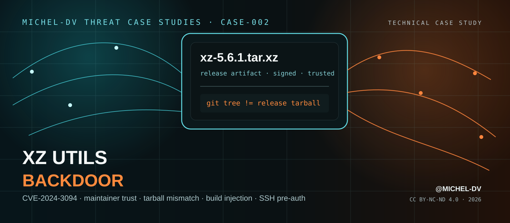

<div align="center">
  

# XZ Utils Backdoor

### Technical Case Study — How Maintainer Trust Became a Supply-Chain Execution Path

**When maintainer trust became the attack path.**

[](#)
[](https://github.com/Michel-DV/xz-utils-backdoor-case-study/releases/tag/v1.0.0)
[](report/XZ_Utils_Backdoor_Case_Study_Michel-DV.pdf)
[](LICENSE)
[](https://github.com/Michel-DV)

</div>

---

## Overview

**CASE-002** reconstructs the XZ Utils / liblzma backdoor disclosed on 29 March 2024 as **CVE-2024-3094**.

The report follows the operation from long-term maintainer trust and release authority, through the mismatch between reviewed Git source and distributed release tarballs, into build-time payload extraction, liblzma modification, the transitive dependency path into `sshd`, GNU IFUNC / dynamic-linker abuse, and the operator-only pre-authentication trigger.

The focus is not merely *what the backdoor did*, but **how multiple legitimate trust relationships were converted into an execution path**.

> **Core lesson:** source review is not release verification, and a signed upstream artifact is only as trustworthy as the human and build process that produced it.

## Read the report

**[Open the report in the repository →](report/XZ_Utils_Backdoor_Case_Study_Michel-DV.pdf)**  
**[Download the v1.0.0 release asset →](https://github.com/Michel-DV/xz-utils-backdoor-case-study/releases/download/v1.0.0/XZ_Utils_Backdoor_Case_Study_Michel-DV.pdf)**

Integrity check: [`report/SHA256SUMS.txt`](report/SHA256SUMS.txt)

## Attack chain at a glance


## Key findings

| Finding | Why it matters |
|---|---|
| **Maintainer trust was part of the exploit chain** | The attacker operated from inside a legitimate project role rather than simply stealing a package account at the final stage. |
| **Git source and release tarballs were not security-equivalent** | Release-only generated build logic introduced a path that ordinary Git review did not expose. |
| **Opaque test data became executable build input** | Crafted `.xz` / `.lzma` fixtures carried hidden stages that were recovered during compilation. |
| **The payload relied on a transitive dependency path** | OpenSSH itself was not backdoored; liblzma reached selected `sshd` builds indirectly through distribution-specific systemd integration. |
| **Runtime activation was deliberately narrow** | Platform, build, process, environment and cryptographic gates reduced accidental exposure and analysis. |
| **The discovery came from anomaly investigation** | CPU, latency and Valgrind irregularities exposed a supply-chain compromise that static trust signals had accepted. |

## What the report covers

1. Incident profile and confidence model
2. Strategic value of XZ Utils
3. 2021–2024 trust and release timeline
4. Maintainer trust / social-engineering dimension
5. Git vs release-tarball mismatch
6. Build-stage extraction and payload injection
7. Platform targeting and anti-analysis conditions
8. `sshd → libsystemd → liblzma` dependency path
9. GNU IFUNC / dynamic-linker abuse
10. Cryptographic operator trigger and pre-auth access
11. Discovery through performance / Valgrind anomalies
12. Debian, Fedora, Kali and RHEL exposure analysis
13. Remediation and trust restoration
14. Representative MITRE ATT&CK mapping
15. **Original trust-boundary attack-path reconstruction**
16. **Detection hypotheses and control blueprint**
17. **Red Team / research emulation notes**
18. Common myths, terminology and primary sources

## Original analysis layer

This case study intentionally goes beyond incident summary.

### Trust-boundary reconstruction

The report maps six conversions of trust:

`contributor → maintainer → release artifact → distro package → runtime library → SSH control path`

At every conversion point, it identifies the attacker's leverage and a defensive choke point.

### Detection hypotheses

The analysis turns the incident into testable hypotheses around:

- tag vs release-artifact reproducibility
- opaque test fixtures becoming executable build inputs
- build provenance and linker inputs
- unexpected libraries inside privileged daemons
- pre-authentication CPU / latency regressions
- maintainer-role escalation and release governance

### Red Team / research notes

The emulation section focuses on **safe trust-path testing**, such as benign tarball/source mismatches and dependency-path validation, without requiring a functioning SSH authentication backdoor.

## Important distinctions

- **XZ 5.6.0 / 5.6.1 exposure is not proof of successful exploitation.**
- **OpenSSH was not the compromised upstream project.** The malicious code was carried by liblzma.
- **systemd and glibc were not “backdoored.”** Normal dependency and runtime mechanisms were abused.
- **The Git repository was not clean in an absolute sense.** Crafted test artifacts and preparatory commits existed there; the decisive initial build path was additionally present in release tarballs.
- **A signature would not solve the governance problem.** A trusted release authority can legitimately sign a malicious artifact.

## Defensive themes

- two-person approval for security-sensitive releases
- hermetic and reproducible release generation
- mandatory tag-to-tarball comparison
- provenance for generated files and binary test fixtures
- independent downstream rebuilds
- minimal transitive dependencies for authentication daemons
- staging rings with sanitizer and performance-regression testing
- periodic maintainer / release-role review

## Reproducible publication

The PDF is generated from version-controlled HTML/CSS by `.github/workflows/publish-report.yml`.

The workflow renders the body and dedicated cover separately, merges them, calculates SHA-256, commits the generated PDF and publishes the release asset. This keeps the publication itself aligned with the central lesson of the case: **the path from source to artifact should be observable and reproducible.**

## Methodology

Primary evidence is prioritized over retrospective commentary. The report separates confirmed technical behavior, project records, distribution exposure, later reverse engineering and analytical conclusions.

See [`docs/METHODOLOGY.md`](docs/METHODOLOGY.md) and [`docs/REFERENCES.md`](docs/REFERENCES.md).

## Repository structure

```text
.
├── .github/workflows/
│   └── publish-report.yml
├── assets/
│   └── cover-mobile-safe.svg
├── docs/
│   ├── METHODOLOGY.md
│   └── REFERENCES.md
├── report/
│   ├── cover.html
│   ├── source.html
│   ├── XZ_Utils_Backdoor_Case_Study_Michel-DV.pdf
│   └── SHA256SUMS.txt
├── CHANGELOG.md
├── CITATION.cff
├── DISCLAIMER.md
├── RELEASE_NOTES.md
├── LICENSE
└── README.md
```

## Citation

If this case study is useful in research, training, coursework or internal documentation, please cite the repository or use [`CITATION.cff`](CITATION.cff).

**Author:** [@Michel-DV](https://github.com/Michel-DV)  
**Series:** Michel-DV Threat Case Studies — CASE-002  
**Release:** v1.0.0  
**Year:** 2026

## License

© 2026 **Michel-DV**.

This publication is licensed under **Creative Commons Attribution-NonCommercial-NoDerivatives 4.0 International (CC BY-NC-ND 4.0)**.

## Disclaimer

This is an independent technical study based on publicly available information. It is not affiliated with or endorsed by the Tukaani Project, Red Hat, Debian, OpenSSF, OpenSSH, systemd, Kaspersky, or other referenced organizations.

---

<div align="center">

**The XZ incident was not a single malicious patch. It was a chain of trusted handoffs that no one control independently verified.**

[@Michel-DV](https://github.com/Michel-DV)

</div>
